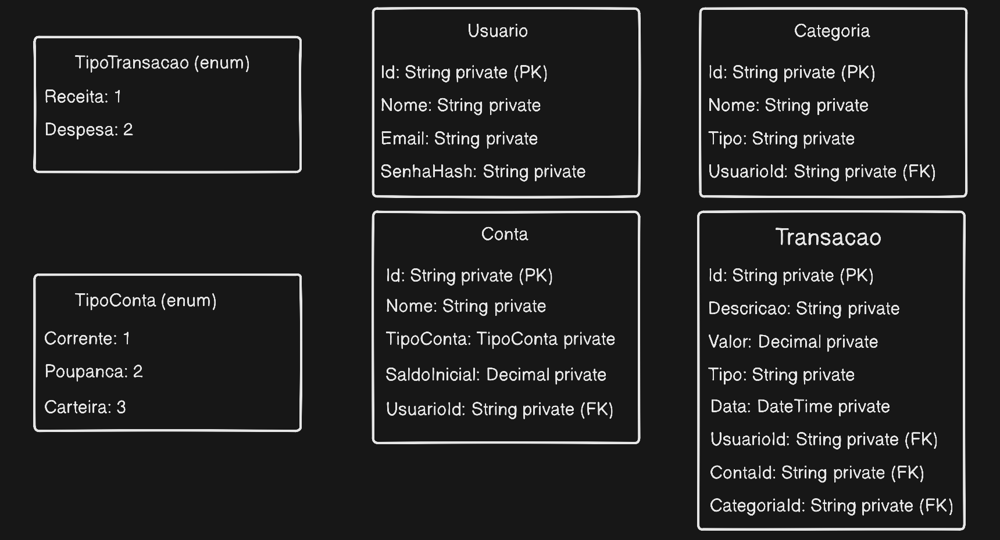

# 📦 Sistema de Gestão de Financeira


Uma aplicação feita para controle de gastos e gestão de contas. O sistema permite o cadastro, listagem, atualização e exclusão de usuários, contas, categorias e transações fornecendo uma interface amigável e uma API robusta.

## ✨ Funcionalidades
* Cadastro e controle de usuários, contas, categorias e transações.
* Dashboard financeiro para cada usuário.
* Listagem de transações com filtros diversificados.

## 🚀 Como Começar

O primeiro passo é fazer o clone deste repositório para a sua máquina local:

```bash
git clone https://github.com/Gustavo-Falcao/Gestao-Financeira-API.git
``` 

Após clonar o projeto, navegue para a pasta raiz:

```bash
cd Gestao-Financeira-API
```

## 🏗️ Estrutura do Projeto e Documentação

O projeto está dividido em duas partes independentes. Clique nos links abaixo para acessar as instruções detalhadas de como configurar e rodar cada ambiente:

* ⚙️ [**Backend (API)**](./backEnd/README.md) - Desenvolvido em C# com .NET e SQLite.
* 🖥️ [**Frontend (Web)**](./frontEnd/README.md) - Interface do usuário desenvolvida em React.


# Gestão Financeira API

Este projeto consiste em uma Web API desenvolvida em C# utilizando ASP.NET, com o objetivo de gerenciar finanças pessoais.


## A aplicação permite o cadastro e gerenciamento de:
Usuários

Contas

Categorias

Transações


## Tecnologias Utilizadas
C#

ASP.NET Web API

Entity Framework Core

SQLite

Swagger


## O projeto foi estruturado em camadas, seguindo o Repository Pattern:
Controllers → recebem requisições HTTP

Services → contêm regras de negócio

Repositories → acesso ao banco de dados

Models (Entities e DTOs) → representação dos dados


## Endpoints

### Usuários
GET /api/users

GET /api/users/{id}

POST /api/users

PUT /api/users/{id}

DELETE /api/users/{id}

### Contas
GET /api/contas

GET /api/contas/{id}

POST /api/contas

PUT /api/contas/{id}

DELETE /api/contas/{id}
### Transações

GET /api/transacoes

GET /api/transacoes/{id}

POST /api/transacoes

PUT /api/transacoes/{id}

DELETE /api/transacoes/{id}

### Categorias
GET /api/categorias

GET /api/categorias/{id}

POST /api/categorias

PUT /api/categorias/{id}

DELETE /api/categorias/{id}

## Modelagem inicial do projeto



